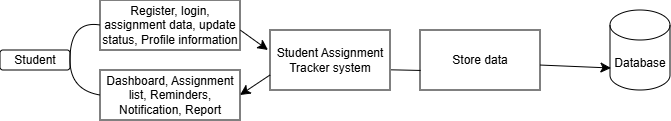

# Data Flow Diagram (DFD)

## 1. Introduction

The Data Flow Diagram (DFD) represents the flow of data within the **Student Assignment Tracker** system.  
It shows how users interact with the system, how data is processed, and how information is stored and retrieved.

---

## 2. System Overview

The Student Assignment Tracker is a web-based application that helps students manage their assignments, track deadlines, and monitor assignment progress.

The main actors of the system are:

- **Student**
- **System Administrator**

The system manages:
- User authentication
- Assignment creation
- Assignment updates
- Deadline tracking
- Assignment status management
- Notifications and reports

---

# 3. Data Flow Diagram (Level 0 / Context Diagram)

The following diagram shows the high-level interaction between external entities and the Student Assignment Tracker system.

---

# 4. DFD Components

## External Entities

### Student
The student interacts with the system to:

- Register/Login
- Add assignments
- Update assignment information
- Check deadlines
- Mark assignments as completed
- View progress

---

### Administrator

The administrator manages:

- User accounts
- System information
- Application monitoring

---

# 5. Processes

## Process 1: User Authentication

Handles:

- User registration
- Login verification
- Session management

Input:
- User credentials

Output:
- Authentication status

---

## Process 2: Assignment Management

Handles:

- Creating assignments
- Editing assignments
- Deleting assignments
- Updating assignment status

Input:
- Assignment details

Output:
- Updated assignment records

---

## Process 3: Deadline Tracking

Handles:

- Checking upcoming deadlines
- Generating reminders

Input:
- Assignment due dates

Output:
- Deadline notifications

---

## Process 4: Progress Monitoring

Handles:

- Tracking completed assignments
- Generating progress information

Input:
- Assignment status

Output:
- Progress report

---

# 6. Data Stores

## User Database

Stores:

- User information
- Login credentials
- Profile data

## Assignment Database

Stores:

- Assignment title
- Course name
- Description
- Deadline
- Status

## Notification Database

Stores:

- Reminder information
- Notification history

---

# 7. Data Flow Description

| Data Flow | Description |
|---|---|
| User Information | Student provides registration/login information |
| Assignment Data | Student creates or updates assignment details |
| Deadline Data | System processes due dates |
| Notification Data | System sends deadline reminders |
| Progress Data | System generates completion reports |

---

# 8. Conclusion

The DFD illustrates how data moves through the Student Assignment Tracker system.  
It provides a clear understanding of system processes, external interactions, and data storage.